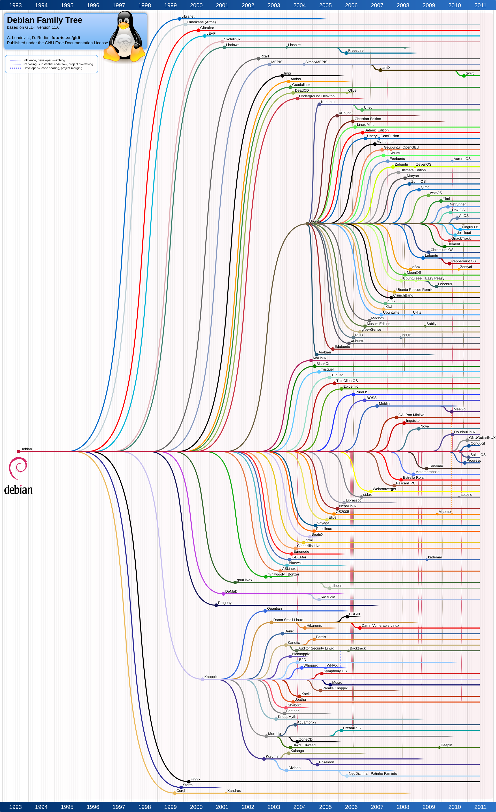

Linux comes in countless flavours, known as distributions (or distros for short). At its core, Linux is just the kernel - the low-level program that manages hardware and system resources. What most people call "Linux" is technically GNU/Linux: the kernel combined with the GNU project's free software tools that make it a complete operating system. In everyday conversation though, we simply call it Linux.

As you probably quickly find out, Linux comes in many different distros. But what does a distro get you? A distro is essentially a premade bundle built around the Linux kernel, but it doesn't stop there. It also includes the software that makes your computer actually usable: essential tools and libraries that let programmes run, a package manager, a desktop environment that gives your system its look and feel, are pre-installed to get you started. On top of that, each distro comes with its own community and support network to help in the event of something going wrong, and yes something **will** go wrong. In short, a distro is the complete operating system you can install, run, and enjoy.

## Why Choice Paralysis Happens

Unlike most operating systems, Linux lets you choose almost every part of your setup. You can pick a **desktop environment** that matches how you like to work, install only the software you actually need, and even swap out core components of the system if you want to. This level of control is a big reason why Linux appeals to so many people. But the same freedom is also what makes Linux confusing. With so many choices available, it's easy to feel lost. There are dozens of desktop environments, multiple package managers, and countless distros, each with its own philosophy and way of doing things. For newcomers, that abundance of options often leads to choice paralysis. In short, Linux is attractive because you can shape it to fit your needs, but it's confusing because there are so many paths you could take to get there.

However the reality is that most of those options boil down to just a handful of choices. While there are hundreds of distros to pick from, the majority are built on top of a few core base distros. Over time, most people end up using one of these, whether directly or through one of their many derivatives.

This means that while the Linux world might look overwhelming at first, you're really choosing between a small number of well-established foundations. Once you know which base distros those are, the landscape becomes much clearer. Besides what most people switch a distro for in the beginning is for the **desktop environment** and the **package manager**. More experienced Linux users eventually realise that all distros can provide the same features. The difference lies in how each distro goes about it, with variations in tools, defaults, and setup rather than in what you can ultimately achieve. In most cases, any real issues you run into aren't specific to the distro itself but are general Linux problems. The exceptions usually come when a distro maintainer decides to move away from the defaults of its base distro, which can sometimes introduce quirks or instability.

Since most distros are based on another, it makes sense to go upstream to the source rather than downstream to a derivative. That's why I suggest most people start with the "grandfather" distros: Debian, Fedora, and Arch. These three serve as the foundation for many of the popular options new users usually come across.

There are, of course, other independent distros doing unique and amazing things, such as NixOS, Gentoo, openSUSE, and Void Linux. However, I won't be covering them here, as this post is aimed at newcomers to Linux. I may write about them separately in future posts.

## Rolling vs Stable

One of the first concepts you'll come across when comparing distros is whether they're rolling release or stable release.

A stable release distro provides fixed versions of software that only receive security updates and critical fixes. This makes the system more predictable and reliable, since updates won't suddenly change how your software works. The trade-off is that you don't always get the newest features right away. This may be a problem for people using _bleeding-edge_ hardware that require such new software.

A rolling release distro, constantly updates to the latest versions of software as they're released. This means you always have the newest packages and features, but it can also introduce instability or breakages if something upstream changes.

Debian and Fedora are both stable release distros, but Debian takes stability much further than Fedora. Arch, on the other hand, is a rolling release. It sits at the opposite end of the spectrum from Debian, focused on being as bleeding-edge as possible.

## Debian

Debian is one of the oldest and most influential Linux distributions. It prides itself to stability, long-term support, and commitment to free software. Many distros trace their roots back to Debian, making it one of the pillars of the Linux ecosystem.

Debian is a good choice if you value reliability over bleeding-edge features. It's often used on servers where stability is critical, but it also works well on desktops for users who want a system that "just works" without frequent major changes. It's not the best option if you always want the latest software, but for those who prefer a dependable system, Debian is hard to beat.

Some of the most popular and widely used Linux distros are Debian derivatives. Ubuntu is the most famous example, which itself has spawned many other distros like Linux Mint, Pop!\_OS, and elementary OS. This huge family tree shows just how central Debian is to the wider Linux world.

This is my current distro as of writing. I've had little to no issues with it, apart from the occasional problem with Nvidia drivers, since Debian's versions are often a bit outdated. I don't rely on the newest software, and my setup is clean and minimal, so this hasn't been a problem for me. It might also just be that I'm most familiar with Debian and haven't felt the need to switch after landing on Debian. If you're new to Linux, I recommend starting with Debian. It has a huge support community, so help is easy to find if something goes wrong. The installation process has also improved a lot in recent years, making it much more beginner-friendly. During setup, you can choose from a variety of desktop environments such as GNOME, KDE Plasma, XFCE, or Cinnamon, allowing you to mimic the look and feel of many other popular distros.

## Fedora

Fedora is known for being on the cutting edge while still maintaining a focus on stability. It's the upstream testing ground for Red Hat Enterprise Linux (RHEL), which means new technologies often land in Fedora first before being adopted into the enterprise world. This makes it an important distro for innovation in the Linux ecosystem. RHEL has picked up a bit of a bad reputation recently, which I won't go into here as that's a topic for another post, despite this I still think Fedora is a fantastic distro. That said, because of its connection to RHEL, I personally no longer use Fedora.

You may have already seen its children distros, the most popular being Nobara and Bazzite, both of which aim to provide an opinionated experience on top of Fedora's solid base to create a Linux gaming setup.

Fedora benefits users who want fairly up-to-date software without going fully into rolling release territory. Developers in particular appreciate Fedora because it provides access to newer programming tools, libraries, and kernels while still remaining relatively stable for daily use. It's also a good fit for those interested in seeing where enterprise Linux is headed, since it shapes the direction of RHEL.

It's also a favourite among those who prefer the GNOME desktop in its pure form, since Fedora Workstation ships GNOME with very few modifications.

I like to think of Fedora as the new Ubuntu: a clean environment without Snap packages or heavy customisation. It gives users a pure Linux experience without third-party defaults getting in the way. Sitting somewhere between a rolling and a stable release, Fedora is an excellent final destination for distro hoppers or more technical users who need newer packages.

The only drawback is that it isn't quite as popular as Debian or Arch, which means some problems may not have as much community documentation. Fedora's forums and support channels are usually enough to help you troubleshoot and fix issues.

## Arch Linux

Arch Linux follows a philosophy of simplicity, giving users complete control over their system. Unlike Debian or Fedora, Arch doesn't come with a preconfigured setup. Instead, you build the system yourself, choosing everything from the kernel modules to the desktop environment. This makes it highly customisable and minimal, with nothing installed that you didn't explicitly ask for.

Arch attracts advanced users because of this do-it-yourself approach. It's not that Arch can do things other distros can't - it's that it gives you full control over how those things are done. Recently installing Arch has gotten trivial with the additon of the `arch-install` script. However the issue is that it follows a rolling release model, keeping you on the cutting edge with the latest software updates. With this model the issue of Arch is not the installation of it, but the maintenance of the system, without proper care Arch will break and it will always be the user's fault. Thus I don't recoommend Arch for new users but only for users that require the new packages and/or veteran Linux users that know what they are doing in the event of breakage.

Arch has several children aimed at making it more accessible. Manjaro, for example, provides a user-friendly installer and preconfigured desktop environments, while EndeavourOS offers a lightweight setup that stays closer to Arch but removes some of the complexity of the initial installation. However I haven't used any of these derivative distros myself, since I prefer Arch for its freedom to build my own system from the ground up, I'll leave covering my personal setup to a future post.

## How to Choose Between Them

Just pick based on what you need at the core. If you want stability, go with Debian. If you're setting up a desktop or gaming system and don't mind waiting a little for the latest software, Fedora is a great choice. If you want everything as up to date as possible, choose Arch. Debian gives you rock-solid stability, Fedora feels like a polished workstation, and Arch is a sharp sword - powerful but you can cut yourself with if you're not careful.

Linux is a journey. Start with one of these three and build from there. Most importantly, have fun and enjoy your new home on Linux.
