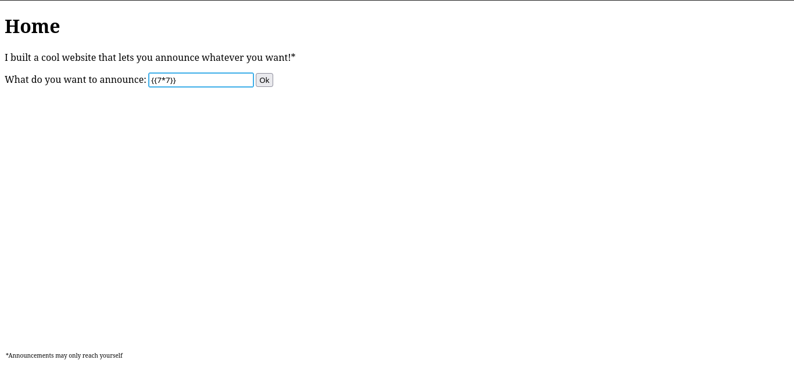
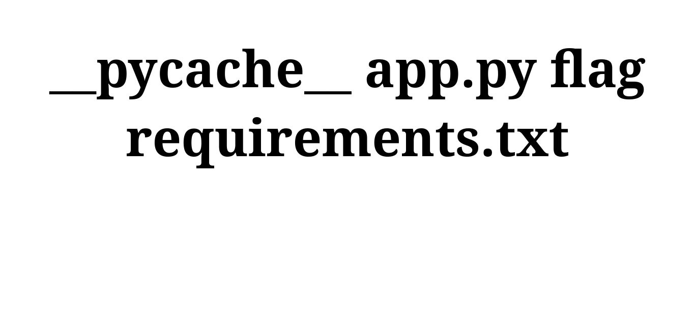
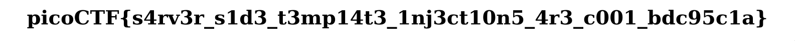

> [!NOTE] Problem - SST1
> I made a cool website where you can announce whatever you want!
> Try it out! I heard templating is a cool and modular way to build web apps!
> Check out my website [here](http://rescued-float.picoctf.net:61957/) !

I recently just wanted to get back into CTFs, not that I was an expert in the matter, but I had some free time today and thought I'd try out a few challenges set by my University's Cyber Security Society. They're using [picoCTF](https://www.picoctf.org/) as the platform for these problems, they have alot of other challenges that you can check out as well and is not affiliated with my University.

## Solution

So I becan working on the first problem: [Web | SSTI1](https://play.picoctf.org/practice/challenge/492?category=1&difficulty=1&page=1), and right away it looked like there was some kind of injection was needed. My first thought was SQL injection, since that's the type of injection I was most familiar with. But pretty quickly it became obvious that wasn't the exploit here. So, I went back to the challenge description to see if I'd missed anything, and the line "I heard templating is cool" immediately made me think of server-side templates you usually see in full stack frameworks such as Django or ASP.NET core.

A quick Google search led me to SSTI, Sever-side Template Injection, funny how the challenge title was giving away the exploit needed. Using the following [SSTI/Payload Cheatsheet](https://github.com/ogtirth/SSTI), I tested to see if the site was actually vulnerable and to figure out which templating engine it was running. Turns out, it was running on a Python server using Jinja2 and was indeed vulnerable to SSTI - inputting `{{7*7}}` into the field renders the result of `49` 'n 'he site.




Naturally, I started looking up Jinja2 SSTI payloads since the ones from the cheatsheet weren't working for me. That search led me to this [article](https://onsecurity.io/article/server-side-template-injection-with-jinja2/), which walked through a vulnerable Python Flask app. It included the following payload:

```
 {{request.application.__globals__.__builtins__.__import__('os').popen('id').read()}} 
```

When I dropped that into the site, it worked - returning the user's ID along with their groups, confirming the exploit.


The payload uses Python's [magic methods](https://rszalski.github.io/magicmethods/) in order to access the `os` module and execute commands on the host. We can then list out the files in the server via:

```
 {{request.application.__globals__.__builtins__.__import__('os').popen('ls').read()}} 
```



Great! we found the flag, its named "flag", all we need to do now is output the contents of the file. We use the `cat` command in our next request:

```
 {{request.application.__globals__.__builtins__.__import__('os').popen('cat flag').read()}} 
```

Giving us our flag!


